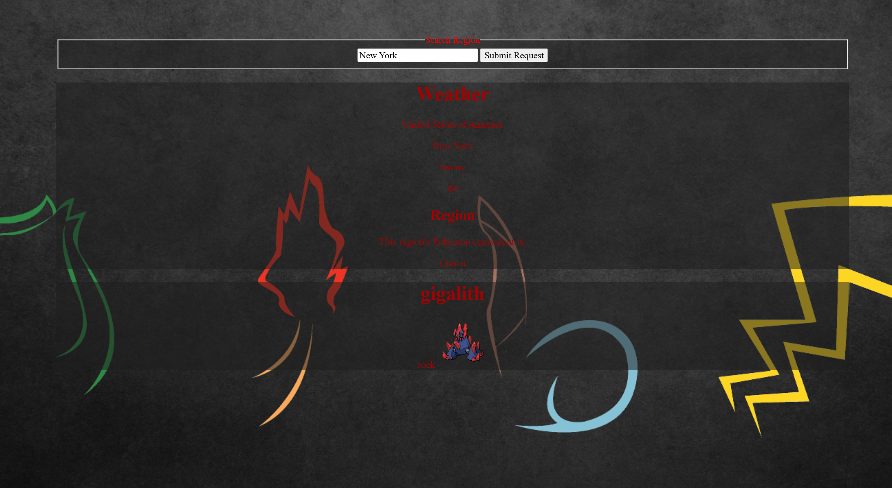

# 📊 Project: Complex API 

### Goal: Use data returned from one api to make a request to another api and display the data returned

#### About
* Using a weather API and the pokemon database, compare the real region entered
to their pokemon world equivalent and display a random pokemon from that region
* Else, display a random pokemon

##### Tech used
* JavaScript
* HTML
* CSS

##### Lessons Learned
* Improved creating and navigating arrays
* Combining navigating arrays with navigating API's